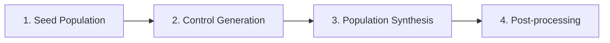

# Process Overview

Understand how the TM2 PopulationSim pipeline works from start to finish.

## Pipeline Architecture

The TM2 pipeline consists of four main stages:

## Documentation

### [Overall Process](overview.html)
Complete walkthrough of the synthesis process, from PUMS data download to final synthetic population.

**Topics covered:**
- Data inputs (PUMS, geographic definitions, controls)
- Geographic framework (Counties, TAZs, MAZs, PUMAs)
- Step-by-step pipeline execution
- Expected outputs at each stage

### [File Flow](file-flow.html)
Detailed documentation of all input and output files, their purposes, and relationships.

**Topics covered:**
- Input file descriptions
- Intermediate file tracking
- Output file specifications
- Data lineage and dependencies

## Quick Reference

| Stage | Input | Output | Purpose |
|-------|-------|--------|---------|
| Seed Population | PUMS data, crosswalk | `seed_households.csv`, `seed_persons.csv` | Create base microdata sample |
| Control Generation | Census data, zones | `controls_*_taz.csv` | Generate target marginals |
| Synthesis | Seed + controls | `synthetic_households.csv`, `synthetic_persons.csv` | Match microdata to controls |
| Post-processing | Synthetic population | Final outputs, summaries | Format and validate results |

## Related Guides

- [Geographic Crosswalk](../guides/geo-crosswalk.html) - How zones are mapped
- [Seed Population](../guides/seed-population.html) - Creating the seed data
- [Control Generation](../guides/control-generation.html) - Building marginal controls
- [Population Synthesis](../guides/population-synthesis.html) - Running the synthesizer

---

[← Back to Home](../index.html)
